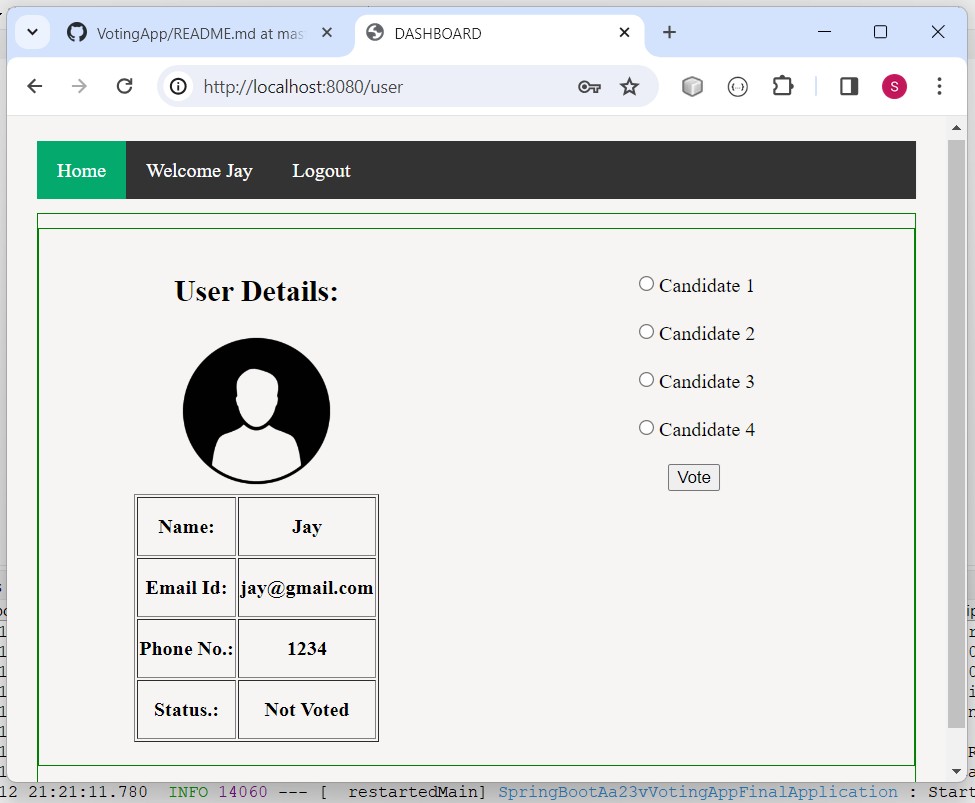
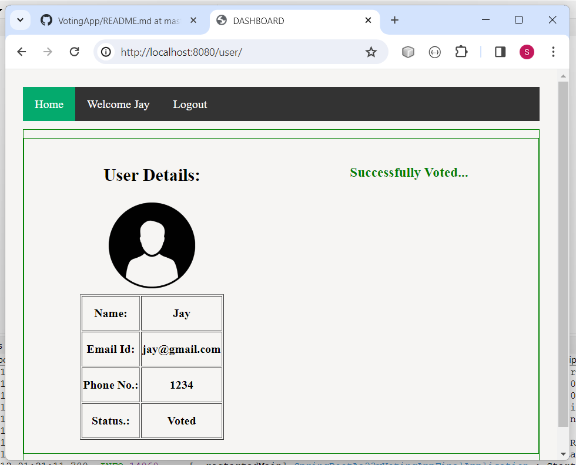
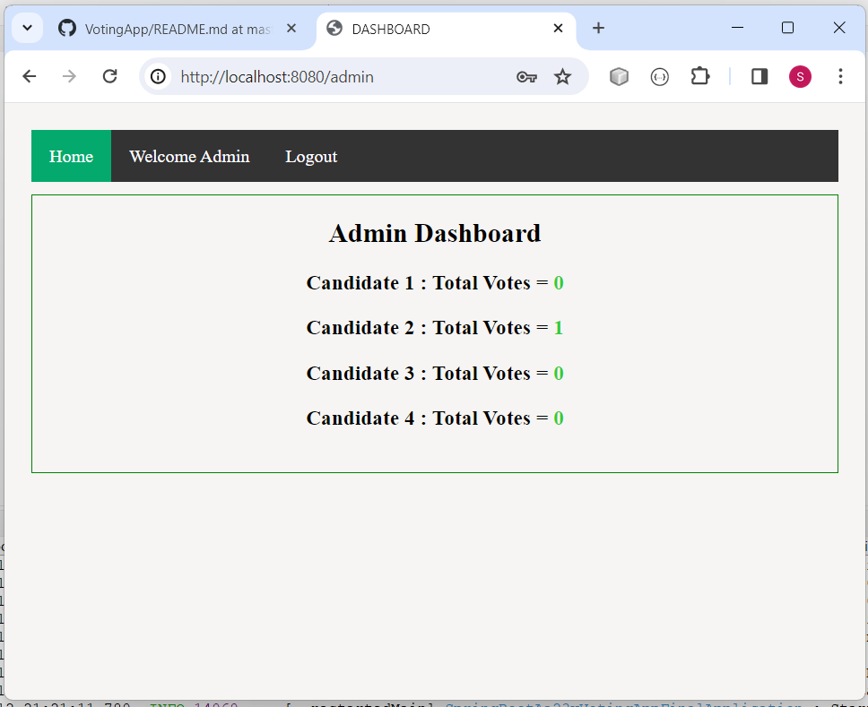
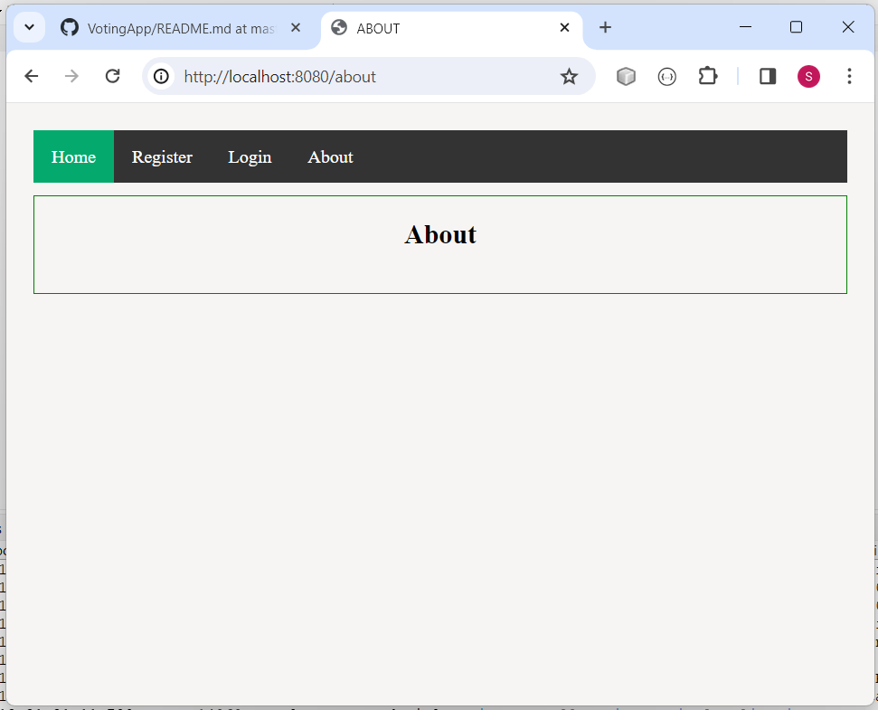
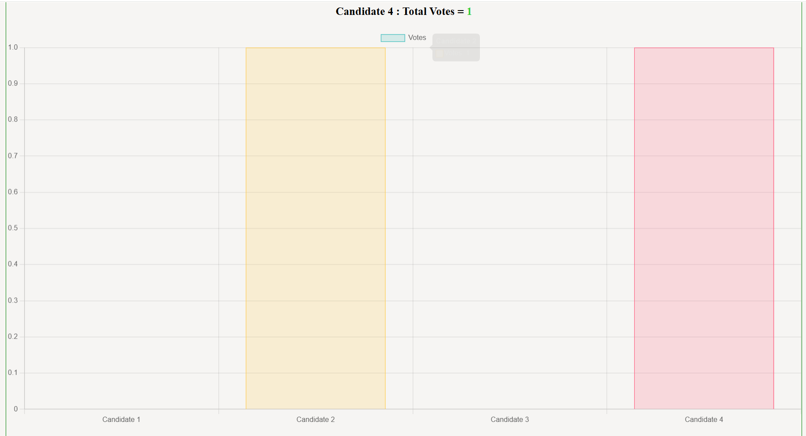

# VotingApp

A simple Spring Boot application for online voting management.

---

## Features
- User registration and login
- Admin and user dashboards
- Candidate management
- Voting functionality

---

## Prerequisites
- Java JDK 17 or later
- MySQL database
- (Optional) IDE like IntelliJ IDEA, Eclipse, or VS Code

---

## Setup Instructions

### 1. Clone the Repository
```
git clone <repo-url>
cd VotingApp/MySpring_Boot_aa23v_VotingApp_Final
```

### 2. Configure the Database
- Create a MySQL database named `zinterview` (or as specified in `application.properties`).
- Update `src/main/resources/application.properties` with your MySQL username and password:
  ```
  spring.datasource.url=jdbc:mysql://localhost:3306/zinterview
  spring.datasource.username=YOUR_USERNAME
  spring.datasource.password=YOUR_PASSWORD
  ```
- Make sure the `user` table's `phone` column is of type `VARCHAR(20)`:
  ```sql
  USE zinterview;
  ALTER TABLE user MODIFY phone VARCHAR(20);
  ```

### 3. Build and Run the Application
On Windows (using Maven Wrapper):
```
./mvnw clean install
./mvnw spring-boot:run
```

Or run the main class `MySpringBootAa23vVotingAppFinalApplication` from your IDE.

---

## Usage
- Visit [http://localhost:8080](http://localhost:8080) in your browser.
- Register as a user or log in as admin (default admin credentials are set in the code).
- Admin can manage candidates and view results.
- Users can vote for candidates.

---

## Author
**Kondeti Pavan Kumar**










